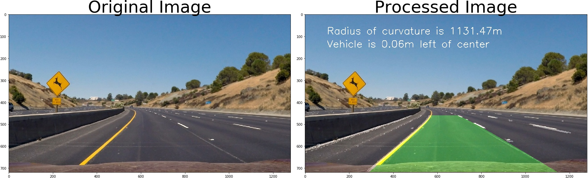

# Advanced Lane Finding

## Introduction

This is Advanced lane finding project of Udacity's Self-Driving Car Engineering Nanodegree.  The lane-finding algorithm must be robust to changing light conditions, curvature of road and type of road itself. It might be enough in the straight highway. The final objective was to apply advanced computer vision techniques to detect lanes and measure the offset on the car between the two lanes and compute curvature of the road.

The result of this project is showed in the next gift 

## Enviroment

#### software  
  
>macOS Mojave 10.14.3, Python 3.

#### Import Packages

>   matplotlib
    numpy 
    OpenCv
    glob
    imageio
    os 
    sys

## The Project
---

The project has the next structure:

* Compute the camera calibration matrix and distortion coefficients by using chessboard images.
* Apply a distortion correction to raw images.
* Use Sobel tecnique and LAB/HLS space to create a thresholded binary image.
* Apply mask to region of interest
* Apply a perspective transform to get top-down view.
* Detect lane pixels and fit to find the lane boundary by getting histogram of the image.
* Determine the curvature of the lane and vehicle position with respect to center.
* Match the detected lane boundaries back onto the original image.
* Output visual display of the lane boundaries and numerical estimation of lane curvature and vehicle position.

The folder `camera_cal` contains the images to camera calibration. The images in `test_images` was used to test each function that form the pipeline. 
The output images of each function used in the [Code.ipynb](Code.ipynb) Notebook were saved in the folder called `output_images`. The video called `project_video.mp4`  and `challenge_video.mp4` were used to test the final pipeline and the were stored in the current folder. The mainly code is in [Code.ipynb](Code.ipynb) notebook. To more details about the project, please see [writeup.md](writeup.md).

## Discussion

### Issues 

Define a value to each color space, gradient and color channnel thresholding generates a complicate way to automatize. Instead, it has to be defining manually.

The slide search windows are broken in a frame that has the lane lines wrong defined or when a shadow overlaps the lane lines

Computer vision solution is sensitive to the chosen parameters, if the parameters are wrong chosen, it fails. So, it is dificult generalize a pipeline that always work to any image or/and video.

